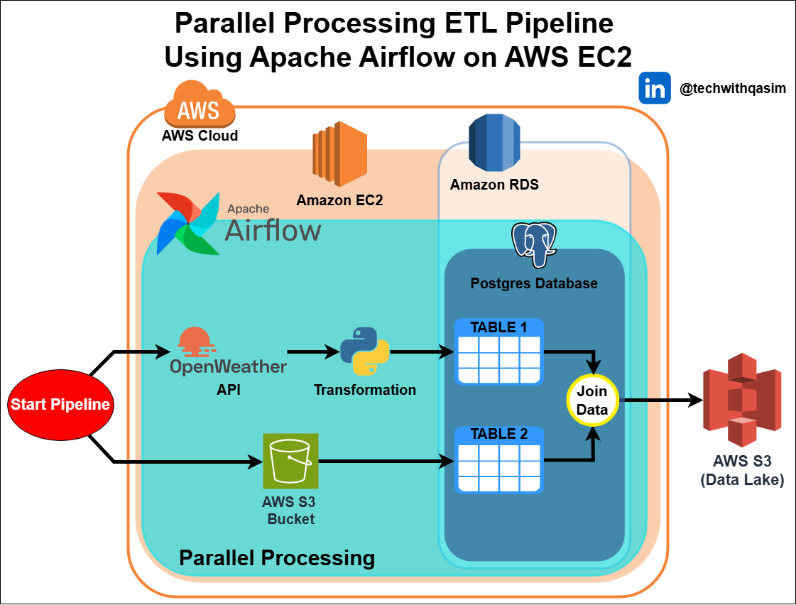

# Parallel Processing ETL Pipeline with Apache Airflow on AWS

This architecture represents an ETL (Extract, Transform, Load) pipeline designed to handle data in parallel using Apache Airflow on AWS. The process starts by triggering the pipeline to fetch data from the OpenWeather API and AWS S3. The data undergoes transformation through Python scripts and is loaded into a PostgreSQL database hosted on Amazon RDS. The pipeline joins multiple tables in the database and exports the final processed data to an AWS S3 data lake for storage and analysis.

Key tools and services used in this architecture include:

- Apache Airflow – Orchestrates the entire pipeline and automates workflow scheduling.
- Amazon EC2 – Hosts the Airflow instance and manages the pipeline execution.
- Amazon RDS – Provides a managed PostgreSQL database for storing and processing data.
- AWS S3 – Acts as both a source and destination for raw and processed data, serving as a scalable data lake.
- OpenWeather API – Supplies weather data for extraction.
- Python – Handles the transformation logic applied to incoming data.

This setup ensures efficient, scalable, and automated data processing with AWS cloud services.